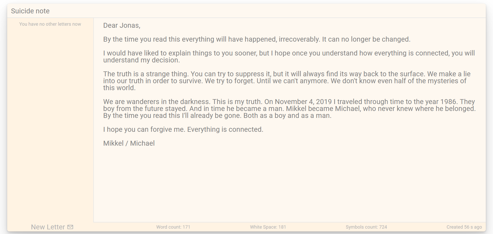

# Letters Notes
## See the demo [here](https://obergodmar.github.io/letters-notes/)

### Table of contents
  - [Description](#description)
  - [Screenshots](#screenshots)
  - [Rules](#rules)
  - [Todo](#todo)
  - [Changelog](#changelog)

### Description
Simply write your letters to anyone. Don't send they. Just Write.

### Screenshots
The suicide note by Michael Kahnwald to his son, Jonas Kahnwald.

### Rules
You can't keep more than 9 letters at the same time.

### Todo
- [x] Add storage system after restart
- [ ] Add rich text
- [ ] Add custom scrollbar
- [ ] Add export & import
- [x] Add ability to change theme
- [x] Add settings
- [x] Add tooltips
- [x] Add page icon
- [ ] Add animations
- [ ] Unit tests

### Changelog
#### [1.2.1] - 2020-05-28
- Add locales: ru & en.
- Change code style.

#### [1.2.0] - 2020-04-20
- Add settings.
- Add page hosting.
- Add app hosting: [letters-notes.herokuapp.com](https://letters-notes.herokuapp.com/)

#### [1.1.3] - 2020-04-20
- Add tooltips.

#### [1.1.0] - 2020-03-31
- Add ability to change theme.
- Fix styling width & height dependencies.

#### [1.0.1] - 2020-03-22
- Add storage system after restart. Branch: `feature/local-storage`.
- Add `v4()` from `node-uuid` for unique IDs. 

#### [1.0.0] - 2020-03-19
- Initial commit
